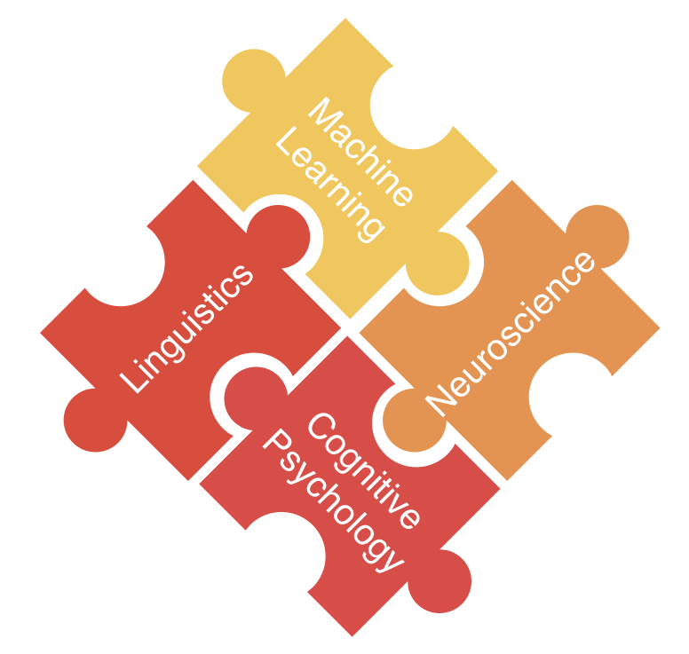

# Brain and Language Laboratory @ NCU

### 如何分析神經活動的訊號？腦磁圖、腦電圖有什麼差別？該怎麼從文獻大海開始尋找議題、設計神經語言學的實驗？閱讀素養的表現是否和大腦的活動有關？學習詞彙或者新的語言，如何改變大腦的運作方式？腦功能訊號可否輔助發展型語言障礙和失語症的鑑別與復健？中文在構詞、文法、音韻上的特性，與拼音語言非常不同，是否因此造成中文使用者以獨特的大腦迴路處理語言？計算科學的自然語言處理，跟大腦裡面的語言處理有什麼差別？

倘若你也對上述的問題感興趣，歡迎來中央大學認知神經科學研究所。本實驗室有充滿活力的PI、研究生、大專專題生，針對訊號分析、語言學、神經科學等議題進行跨領域研究。

## Principal Investigator 實驗室主持人

## Main Interesting 研究項目

## Selective Publications 代表著作

## Courses 教學

## Grants 研究計畫

