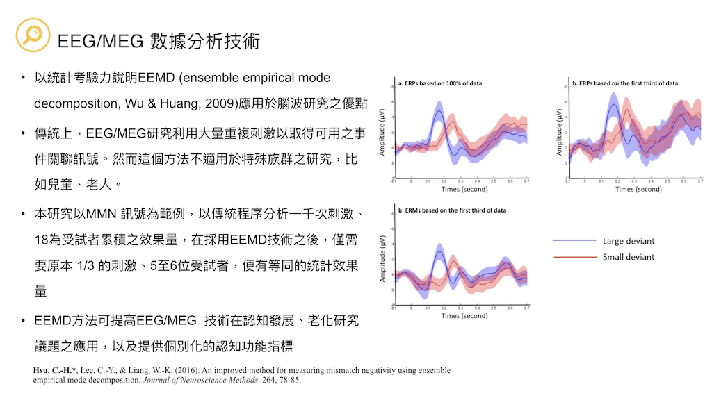

# Brain and Language Laboratory @ NCU
<a href="https://deltaphase.github.io/Brain-and-Language-Lab-Eng/" title="Go to English version">[Go to English version]</a>
  &nbsp;
- 如何分析神經活動的訊號？腦磁圖、腦電圖有什麼差別？
- 該怎麼從文獻大海開始尋找議題、設計神經語言學的實驗？
- 閱讀素養的表現是否和大腦的活動有關？學習詞彙或者新的語言，如何改變大腦的運作方式？
- 腦功能訊號可否輔助發展型語言障礙和失語症的鑑別與復健？
- 中文在構詞、文法、音韻上的特性，與拼音語言非常不同，是否因此造成中文使用者以獨特的大腦迴路處理語言？
- 計算科學的自然語言處理，跟大腦裡面的語言處理有什麼差別？  &nbsp;

倘若上述某些問題使你感興趣，歡迎來中央大學認知神經科學研究所加入**大腦與語言實驗室**。本實驗室有充滿活力的PI、研究助理、研究生，以及大專專題生，針對訊號分析、語言學、神經科學等議題進行跨領域研究。  &nbsp;

## Principal Investigator 實驗室主持人
  
徐峻賢 助理教授  
  
- 學歷：國立陽明大學神經科學研究所 (博士)  
- kevinhsu  **@**  ncu.edu.tw  &nbsp;
  
經歷:  

- 國立中央大學 認知神經科學研究所 助理教授 2018.08~  
- 中央研究院 語言學研究所大腦與語言實驗室 博士後研究員 2012.2~2018.07  
- New York University, Visiting Scholar 2008.8~2009.7  &nbsp;

研究興趣:  
  
- MEG/EEG 訊號分析 (source analysis, HHT, statistical methods)  
- 語音學 (ASR, prosody perception)  
- 構詞學  
- 神經語言學  
- 語言發展  
- 機械學習  &nbsp;
  
獲獎:  
  
- 2019 科技部年輕學者 MOST Young Scholar Fellowship (哥倫布計畫2019.2~2024.1)  
- 2018 國立中央大學新聘傑出教研人員獎  
- 2009 中央研究院語言學研究所跨學科博士候選人培育計畫  
- 2008 行政院國家科學委員會補助博士生赴國外研究  &nbsp;
  
## Main Interests 研究項目  
  
  &nbsp;
  &nbsp;
  &nbsp;
  &nbsp;
  &nbsp;
  &nbsp;

## Courses 教學  
BM2005 Cognitive Neuroscience 認知神經科學  
NS5110 Independent Study: Computational Neuroscience and Language Acquisition 獨立研究：計算神經科學與語言習得  &nbsp;
BM2034 Introduction of Computational Methods of Neural Decoding 神經解碼與計算模型概論
NS5121 Using R for linear model analysis in cognitive science R語言暨應用線性模型於認知科學

## Grants 研究計畫  
2019– The role of morphologcal complexcity and semantic distinctiveness on word recognition and word learning. (MOST-108-2636-H-008-001, MOST Young Scholar Fellowship Columbus Program) 

## Publications 代表著作  
Hsu, C.-H., Pylkkänen, L., Lee, C.-Y (2019) Effects of morphological complexity in left temporal cortex: An MEG study of reading Chinese disyllabic words. Journal of Neurolinguistics. 49, 168-177. (SSCI; corresponding author)  
Tzeng, Y. L., Hsu, C. H., Lin, W. H., & Lee, C. Y. (2018). Impaired orthographic processing in Chinese dyslexic children: Evidence from the lexicality effect on N400. Scientific Studies of Reading, 22(1), 85-100.  
Tzeng, Y.-L., Hsu, C.-H., Huang, Y.-C., Lee, C.-Y (2017) The Acquisition of Orthographic Knowledge: Evidence from the Lexicality Effects on N400. Frontiers in Psychology, 8(433). doi: 10.3389/fpsyg.2017.00433  
Lee, R. R.-H, Hsu, C.-H., Lin, S.-K, Wu, D. H., & Tzeng, O. J.-L. (2017). Learning transforms functional organization for Mandarin lexical tone discrimination in the brain: Evidence from a MEG experiment on second language learning. Journal of Neurolinguistics. 42, 124-139. (SCI)  
Hsu, C.-H., Lee, C.-Y., & Liang, W.-K. (2016). An improved method for measuring mismatch negativity using ensemble empirical mode decomposition. Journal of Neuroscience Methods. 264, 78-85. (SCI; corresponding author)  
Chen, W.-F., Chao, P.-C., Chang, Y.-N., Hsu, C.-H., & Lee, C.-Y. (2016). Effects of orthographic consistency and homophone density on Chinese spoken word recognition. Brain and Language, 157-158, 51-62. (SCI, SSCI)  
Chang, Y.-N., Hsu, C.-H., Tsai, J.-L., Chen, C.-L., & Lee, C.-Y. (2016). A psycholinguistic database for traditional Chinese character naming. Behavior Research methods. 48(1), 112-122. (SSCI)  
Yang, M.-T., Hsu, C.-H., Yeh, P.-W., Lee, W.-T., Liang, J.-S., Fu, W.-M., & Lee, C.-Y. (2015). Attention deficits revealed by passive auditory change detection for pure tones and lexical tones in ADHD children. Frontiers in Human Neuroscience, 9(470), 1-13. (SCI)  
Lee, C.-Y., Hsu, C.-H., Chang, Y.-N., Chen, W.-F., & Chao, P.-C. (2015). The feedback consistency effect in Chinese character recognition: Evidence from a psycholinguistic norm. Language and Linguistics, 16(4), 535-554. (SSCI; corresponding author)  
Hsu, C-H., Evans, J., Lee, C.-Y. (2015). Brain responses to spoken F0 changes: Is H special? Journal of Phonetics, 51, 82-92. (SSCI)  
Hsu, C-H., Lee, C.-Y., Tzeng, O. J.-L. (2014). Early MEG markers for reading Chinese phonograms: evidence from radical combinability and consistency effects. Brain and Language, 139, 1-9. (SCI, SSCI; corresponding author).  
Hsu, C-H., Lin, S.-K., Hsu, Y.-Y., Lee, C.-Y. (2014). The neural generators of the mismatch responses to Mandarin lexical tones: An MEG study. Brain Research, 1582, 154-166. (SCI)  
Hsu, C-H., Lee, C.-Y., Marantz, A. (2011). Effects of visual complexity and sublexical information in the occipitotemporal cortex in the reading of Chinese phonograms: a single-trial regression analysis with MEG. Brain and Language. 117(1), 1-11. (SCI, SSCI; corresponding author)  
Hsu, C-H., Tsai, J.-L., Lee, C.-Y., Tzeng, O. J.-L. (2009). Orthographic Combinability and Phonological Consistency Effects in Reading Chinese Phonograms: an Event-Related Potential Study. Brain and Language, 108(1), 56-66. (SCI)  
Lee, C.-Y., Hsu, C.-H., Chang, Y.-N., Chen, W.-F., & Chao, P.-C. (2015). The feedback consistency effect in Chinese character recognition: Evidence from a psycholinguistic norm. Language and Linguistics, 16(4), 535-554. (SSCI; corresponding author)  &nbsp;  

  &nbsp;
