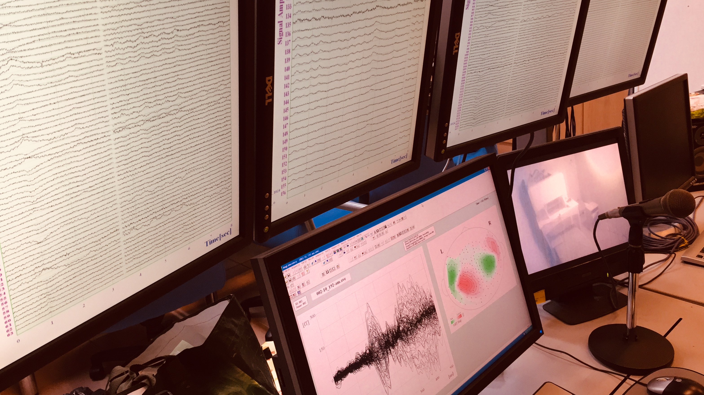
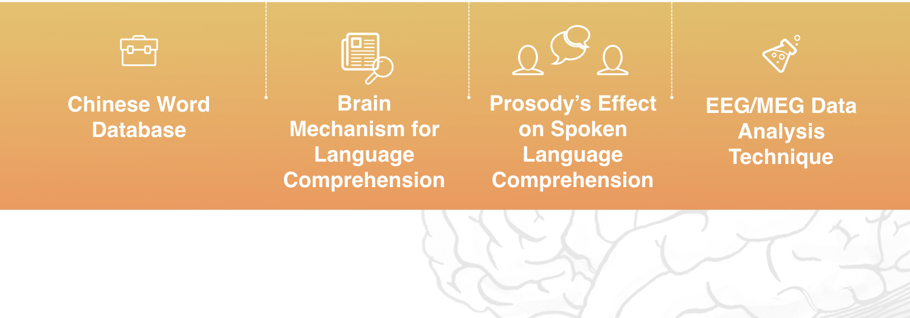
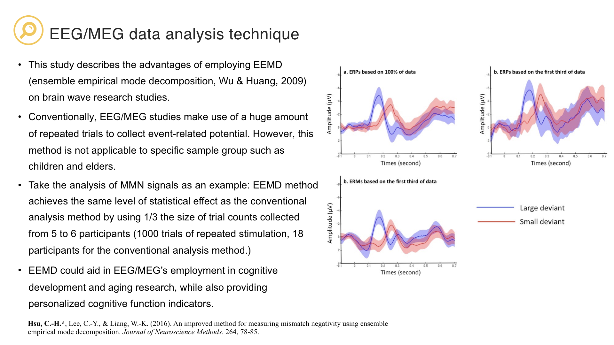
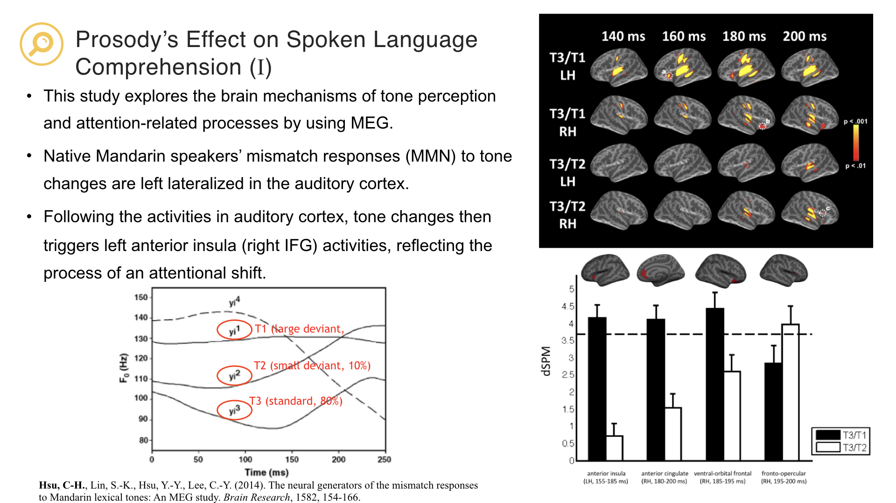
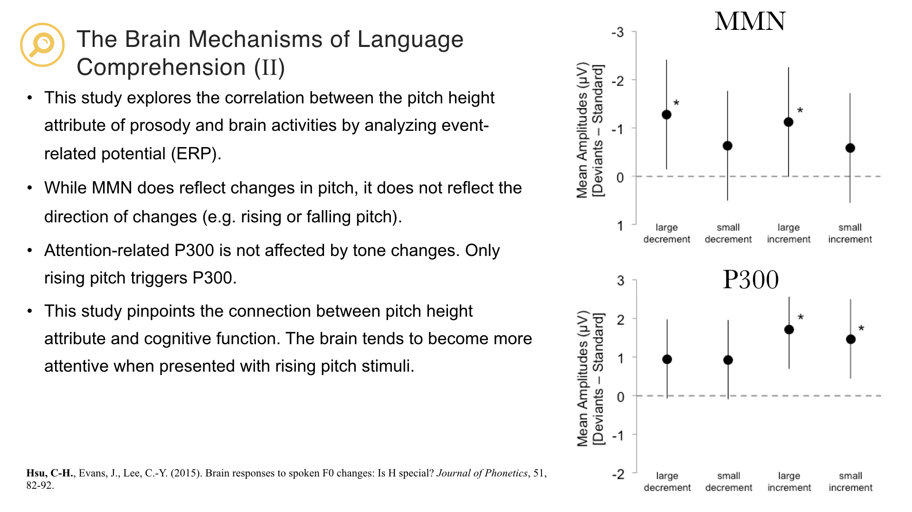
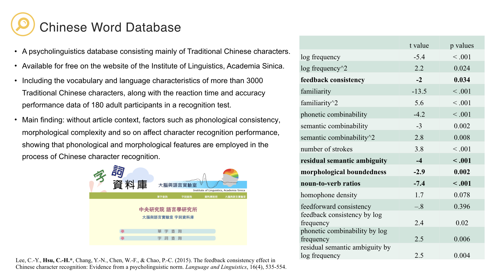
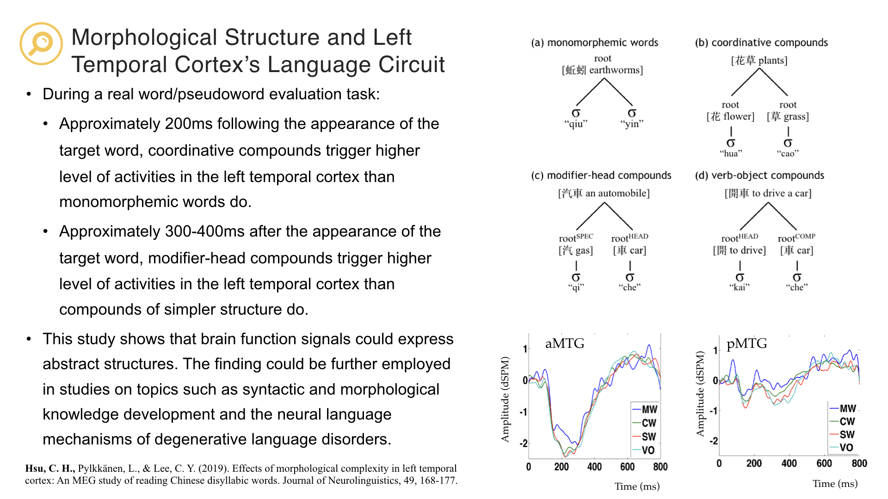

# Brain and Language Laboratory @ NCU
<a href="https://deltaphase.github.io/Brain-and-Language-Laboratory-NCU/" title="前往正體中文版">[前往正體中文版]</a>  
  
  
- How do we analyze neural signals? What is the difference between Magnetoencephalography (MEG) and Electroencephalography (EEG)?  &nbsp;
- How do we search for a topic among a wide variety of research studies and design a neurolinguistic experiment?  &nbsp;
- Is reading performance associated with brain activities? How does learning new words or languages affect brain activity patterns?  &nbsp;
- Could functional brain imaging signals assist the diagnosis and treatment for developmental language impairment?  &nbsp;
- The characteristics of Chinese morphology, syntax, and prosody are very different than those of alphabetic languages. Would Chinese speakers thus employ distinct neural circuits when processing language?  &nbsp;
- What are the differences between computational natural language processing and the actual processing of language in the brain?  &nbsp;

If you are interested in any of the questions above, you are encouraged to join our lab! The Brain and Language Laboratory conducts interdisciplinary studies on topics such as signal analysis, linguistics, and computational neuroscience.   &nbsp;

## Principal Investigator
  
Dr. Chun-hsien Hsu
Assistant Professor
  
- Education：Ph.D.	National Yang-Ming University, Taipei, Taiwan (Neuroscience)
- kevinhsu  **@**  ncu.edu.tw  &nbsp;
  
Academic Position:  

- Assistant Professor, Institute of Cognitive Neuroscience, National Central University 2018.08~present  
- Postdoctoral fellow, Institute of Linguistics, Academia Sinica 2012.2~2018.07  
- New York University, Visiting Scholar 2008.8~2009.7  &nbsp;

Research Interests:  
  
- MEG/EEG signal analyses (source analysis, HHT, statistical methods)  
- Phonology (ASR, prosody perception)  
- Morphology  
- Neurolinguistics  
- Language Acquisition  
- Machine Learning  &nbsp;
  
Awards:  
  
- 2019 MOST Young Scholar Fellowship  
- 2009 Institute of Linguistics Fellowship for Cross-Disciplinary Doctoral Candidates  
- 2008 Scholarship of National Science Council  &nbsp;
  
## Main Interests  
  
  &nbsp;
  &nbsp;
  &nbsp;
  &nbsp;
  &nbsp;
  &nbsp;

## Courses  
BM2005 Cognitive Neuroscience  
NS5110 Independent Study: Computational Neuroscience and Language Acquisition  
BM2034 Introduction of Computational Methods of Neural Decoding  
NS5121 Using R for linear model analysis in cognitive science  &nbsp;

## Grants  
2019–2024 The role of morphologcal complexcity and semantic distinctiveness on word recognition and word learning. (MOST-108-2636-H-008-001, MOST Young Scholar Fellowship Columbus Program) 

## Publications  
Hsu, C.-H., Pylkkänen, L., Lee, C.-Y (2019) Effects of morphological complexity in left temporal cortex: An MEG study of reading Chinese disyllabic words. Journal of Neurolinguistics. 49, 168-177. (SSCI; corresponding author)  
Tzeng, Y. L., Hsu, C. H., Lin, W. H., & Lee, C. Y. (2018). Impaired orthographic processing in Chinese dyslexic children: Evidence from the lexicality effect on N400. Scientific Studies of Reading, 22(1), 85-100.  
Tzeng, Y.-L., Hsu, C.-H., Huang, Y.-C., Lee, C.-Y (2017) The Acquisition of Orthographic Knowledge: Evidence from the Lexicality Effects on N400. Frontiers in Psychology, 8(433). doi: 10.3389/fpsyg.2017.00433  
Lee, R. R.-H, Hsu, C.-H., Lin, S.-K, Wu, D. H., & Tzeng, O. J.-L. (2017). Learning transforms functional organization for Mandarin lexical tone discrimination in the brain: Evidence from a MEG experiment on second language learning. Journal of Neurolinguistics. 42, 124-139. (SCI)  
Hsu, C.-H., Lee, C.-Y., & Liang, W.-K. (2016). An improved method for measuring mismatch negativity using ensemble empirical mode decomposition. Journal of Neuroscience Methods. 264, 78-85. (SCI; corresponding author)  
Chen, W.-F., Chao, P.-C., Chang, Y.-N., Hsu, C.-H., & Lee, C.-Y. (2016). Effects of orthographic consistency and homophone density on Chinese spoken word recognition. Brain and Language, 157-158, 51-62. (SCI, SSCI)  
Chang, Y.-N., Hsu, C.-H., Tsai, J.-L., Chen, C.-L., & Lee, C.-Y. (2016). A psycholinguistic database for traditional Chinese character naming. Behavior Research methods. 48(1), 112-122. (SSCI)  
Yang, M.-T., Hsu, C.-H., Yeh, P.-W., Lee, W.-T., Liang, J.-S., Fu, W.-M., & Lee, C.-Y. (2015). Attention deficits revealed by passive auditory change detection for pure tones and lexical tones in ADHD children. Frontiers in Human Neuroscience, 9(470), 1-13. (SCI)  
Lee, C.-Y., Hsu, C.-H., Chang, Y.-N., Chen, W.-F., & Chao, P.-C. (2015). The feedback consistency effect in Chinese character recognition: Evidence from a psycholinguistic norm. Language and Linguistics, 16(4), 535-554. (SSCI; corresponding author)  
Hsu, C-H., Evans, J., Lee, C.-Y. (2015). Brain responses to spoken F0 changes: Is H special? Journal of Phonetics, 51, 82-92. (SSCI)  
Hsu, C-H., Lee, C.-Y., Tzeng, O. J.-L. (2014). Early MEG markers for reading Chinese phonograms: evidence from radical combinability and consistency effects. Brain and Language, 139, 1-9. (SCI, SSCI; corresponding author).  
Hsu, C-H., Lin, S.-K., Hsu, Y.-Y., Lee, C.-Y. (2014). The neural generators of the mismatch responses to Mandarin lexical tones: An MEG study. Brain Research, 1582, 154-166. (SCI)  
Hsu, C-H., Lee, C.-Y., Marantz, A. (2011). Effects of visual complexity and sublexical information in the occipitotemporal cortex in the reading of Chinese phonograms: a single-trial regression analysis with MEG. Brain and Language. 117(1), 1-11. (SCI, SSCI; corresponding author)  
Hsu, C-H., Tsai, J.-L., Lee, C.-Y., Tzeng, O. J.-L. (2009). Orthographic Combinability and Phonological Consistency Effects in Reading Chinese Phonograms: an Event-Related Potential Study. Brain and Language, 108(1), 56-66. (SCI)  
Lee, C.-Y., Hsu, C.-H., Chang, Y.-N., Chen, W.-F., & Chao, P.-C. (2015). The feedback consistency effect in Chinese character recognition: Evidence from a psycholinguistic norm. Language and Linguistics, 16(4), 535-554. (SSCI; corresponding author)  &nbsp;  

  &nbsp;
